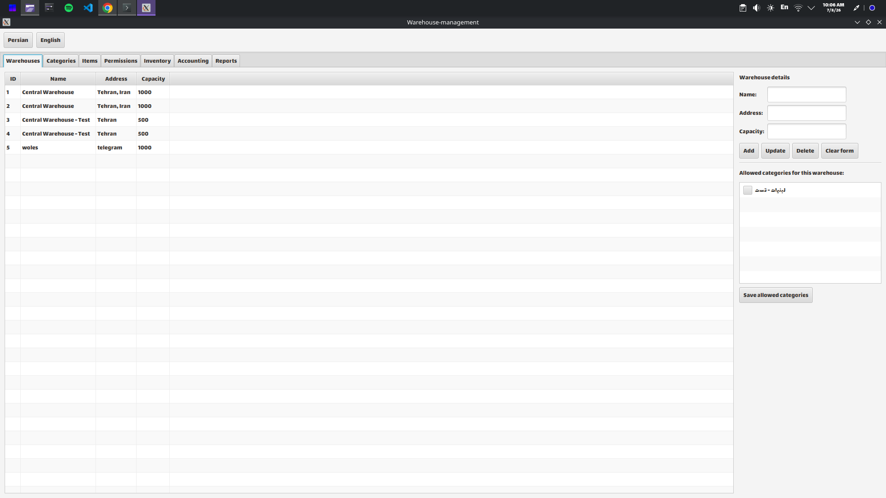

# Warehouse Management System

> A Java desktop application for managing multiple warehouses using **JavaFX**, **JDBC**, and **SQLite**, following a **Layered Architecture (Model → DAO → Service → GUI)**.



---

## Overview

Warehouse Management System is a desktop application designed to manage inventory across multiple warehouses while enforcing real-world business rules.

Instead of directly modifying inventory, every movement of goods is handled through **Incoming** and **Outgoing Permits**, ensuring that inventory remains consistent and traceable throughout the entire workflow.

The project was developed as a university software engineering project with a strong focus on clean architecture, business logic, and maintainability.

---

## Features

* Multi-warehouse management
* Product & hierarchical category management (`parent_id`)
* Incoming and outgoing permit management
* Inventory reservation system
* Warehouse capacity validation
* Accounting validation (cash & inventory)
* Monthly reporting
* Real-time inventory tracking
* SQLite database with JDBC
* JavaFX desktop interface

---

## Architecture

The application follows a layered architecture to separate responsibilities.

```text
┌──────────────────────────────┐
│ GUI Layer (JavaFX)           │
│ Tabs & User Interface        │
└──────────────┬───────────────┘
               │
┌──────────────▼───────────────┐
│ Service Layer                │
│ Business Rules & Validation  │
└──────────────┬───────────────┘
               │
┌──────────────▼───────────────┐
│ DAO Layer                    │
│ JDBC Data Access             │
└──────────────┬───────────────┘
               │
┌──────────────▼───────────────┐
│ SQLite Database              │
└──────────────────────────────┘
```

---

## Business Workflow

Every inventory movement follows the same process.

```text
Create Incoming / Outgoing Permit
                │
                ▼
      Business Validation
      • Warehouse Capacity
      • Allowed Category
      • Cash Availability
      • Inventory Availability
                │
                ▼
        Status = ISSUED
                │
                ▼
 Warehouse Manager Confirmation
                │
                ▼
         Status = DONE
                │
                ▼
 Inventory & Accounting Updated
```

---

## Business Rules

### Available Stock

```text
Available Stock =
Physical Inventory − Issued Outgoing Quantity
```

### Incoming Stock

```text
Incoming Stock =
Issued Incoming Quantity
```

### Capacity Validation

```text
Physical Inventory
+ Incoming Stock
+ New Quantity
≤ Warehouse Capacity
```

---

## Project Modules

### Warehouse Management

Each warehouse contains:

* ID
* Name
* Address
* Capacity
* Allowed Product Categories

---

### Product & Category Management

Products belong to exactly one category.

The system supports **hierarchical categories** using the `parent_id` field.

Example:

```text
Food
├── Dairy
├── Beverages
└── Snacks
```

---

### Permit Management

Each permit contains:

* Incoming / Outgoing Type
* Warehouse
* Product
* Quantity
* Title
* Description
* Date
* Status

Permit Status:

```text
ISSUED
   │
   ▼
 DONE
```

---

### Accounting

The accounting module validates:

* Cash availability
* Warehouse capacity
* Product inventory

If validation succeeds, the corresponding permit is created automatically.

---

### Reporting

The application provides reports for:

* Physical Inventory
* Reserved Inventory
* Incoming Inventory
* Available Inventory
* Monthly Sales
* Revenue
* Pending Permits
* Completed Permits

---

## Technology Stack

* Java
* JavaFX
* JDBC
* SQLite
* Maven
* Object-Oriented Programming
* Layered Architecture (Model / DAO / Service / GUI)

---

## Project Structure

```text
src
├── model
├── dao
├── service
├── gui
├── db
└── util
```

---

## Design Goals

The project emphasizes:

* Separation of Concerns
* Clean Layered Architecture
* Business Rule Validation
* Maintainability
* Scalability
* Readable Object-Oriented Design

---

## Future Improvements

* Product transfer between warehouses
* User authentication & authorization
* Dashboard with charts
* Export reports (PDF / Excel)
* REST API
* PostgreSQL support

---

## License

This project was developed for educational purposes as part of a university course.
